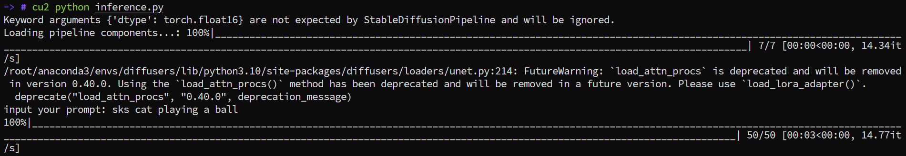

# 项目结构
```
DreamBooth/
├── data/                       # 训练数据目录
│   ├── cat/                    # 示例类别数据（如 class images）
│   │   ├── *.jpg
│   │   └── ...
│   ├── diandian/               # 自定义实例数据（DreamBooth instance images）
│   │   ├── *.jpg
│   │   └── ...
├── dreambooth_diandian/        # LoRA保存路径
├── generated_image.png         # 示例生成结果（推理输出）
├── inference.py                # 推理脚本（加载 LoRA 权重，输入 prompt，生成并保存图像）
├── train_dreambooth_lora.py    # DreamBooth + LoRA 训练主脚本（基于 diffusers + accelerate）
├── train_dreambooth.sh         # 训练启动脚本（设置 accelerate / CUDA / 超参数，调用 train_dreambooth_lora.py）
├── requirements.txt            # Python 依赖列表（diffusers，transformers，accelerate，torch 等）
└── README.md                   # 项目说明文档

```


# 环境配置

1. 创建虚拟环境
```
conda create -n dreambooth python=3.10 -y
conda activate dreambooth
```

2. 安装基础依赖
```
pip install torch torchvision torchaudio --index-url https://download.pytorch.org/whl/cu118
pip install git+https://gitcode.com/gh_mirrors/dif/diffusers.git
pip install -U -r examples/dreambooth/requirements.txt
```

3. 配置加速环境
```
accelerate config default  # 或手动配置分布式训练参数
```

# 训练与推理

1. 数据集准备
a. 实例图像5张，例如宠物的照片，保存在`./data/[宠物名]`路径下
b. 先验图像（可选）：
自动生成：通过--num_class_images=200参数自动生成
手动准备：200-300张同类别的通用图像

2. 训练
使用diffusers官方提供的`train_dreambooth_lora.py`，具体参数设置见`train_dreambooth.sh`
运行命令
```
sh train_dreambooth.sh
```

3. 推理
载入预训练模型，并加载lora权重，输入prompt，生成宠物照片
运行命令
```
python inference.py
```


